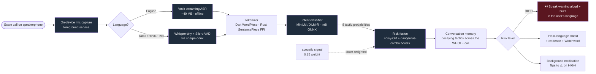
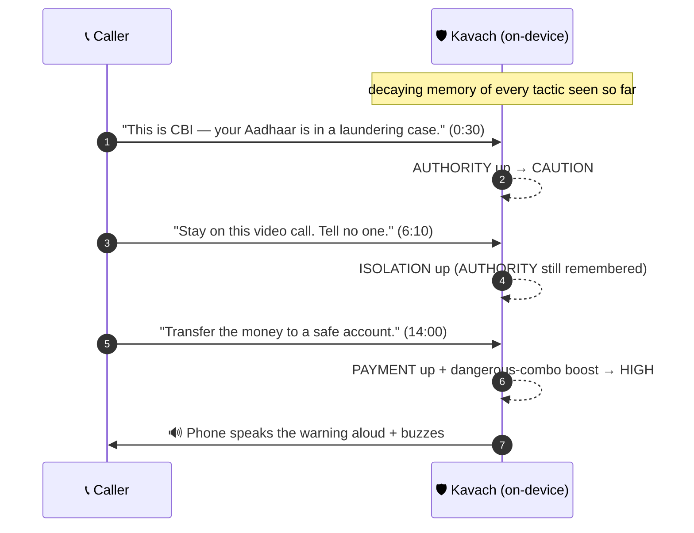
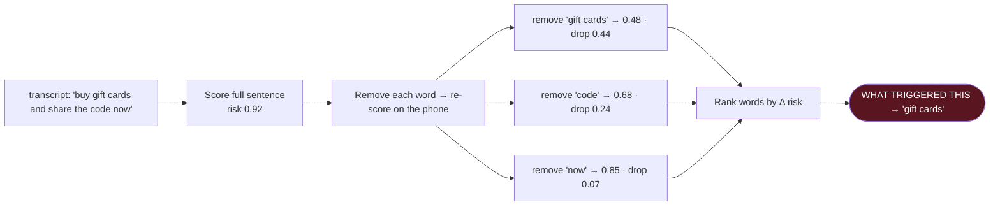

# कवच · Kavach — the offline scam-call shield for the phone you already own


> **Kavach** *(कवच, "armour / shield")* listens to a live phone call **right on the device** and warns
> the person on the call the moment a caller starts running a manipulation **script** — *before* the
> money leaves their hands. **No cloud. No account. No recording.** The app ships with **no `INTERNET`
> permission at all**, so it *physically cannot* phone home — you can audit that in one line of the
> manifest.

Built for **Beyond Tomorrow Summit 2026** · validated **today** on a **₹8,000 / $80 OPPO A18 (4 GB RAM)**.

### 📦 Submission at a glance
| Deliverable | Link |
|---|---|
| 🎬 Demo video (offline, with spoken warning) | [`Videos/Kavach_demo_v2.mp4`](Videos/Kavach_demo_v2.mp4) |
| 🖼️ Pitch deck (13 slides, PDF) | [`docs/Kavach_pitch_deck.pdf`](docs/Kavach_pitch_deck.pdf) |
| 📱 Screenshots (real device) | [`docs/screenshots/`](docs/screenshots/) |
| 📊 Honest eval on real fraud data | [`docs/EVALUATION.md`](docs/EVALUATION.md) |
| 🔒 No-internet proof (release APK) | [`docs/RELEASE_PERMISSIONS.txt`](docs/RELEASE_PERMISSIONS.txt) |
| 🏗️ Architecture deep-dive | [`docs/ARCHITECTURE.md`](docs/ARCHITECTURE.md) |

---

## 1. The problem

Phone scams quietly became the most expensive crime against ordinary people — and AI voice cloning
just deleted the last tell we had. A clone needs a few seconds of audio scraped off social media,
then it calls a parent: *"it's me, I'm in jail, wire the money now, and please don't tell anyone."*

The losses are documented, not vibes:

- **US consumers reported losing $12.5 B to fraud in 2024**; imposter scams alone were **$2.95 B**.
- **Adults 60+ reported $2.4 B lost in 2024 — ~4× the 2020 number** (FTC).
- **FBI IC3** puts 2024 losses for Americans 60+ at **~$4.9 B, average loss $83,000**, up **43%** in one year.
- **India:** the **"digital arrest" scam drained ~₹19,000 crore in 2025**; I4C logged **92,000+** cases in 2024.

Same script, just translated — Hindi, Tamil, Telugu, Spanish, a dozen more.

## 2. Why nothing out there protects the *victim*

Every detector that ships — Pindrop, Reality Defender, Sensity, carrier spam filters — is
**cloud-based, acoustic-only, and built for banks and call-centres.** They protect *institutions*.
Not your grandmother.

- **Carrier / spam-list filters block phone *numbers*** → scammers rotate numbers hourly.
- **Deepfake-voice detectors ask "is this voice synthetic?"** → useless the moment a *real human*
  reads the script, and they fall apart on compressed phone audio anyway.
- **Server-side AI must stream your call to the cloud** → exactly what you can't ethically *or*
  legally do with a vulnerable person's private call (wiretap law, GDPR).

The grandmother on her own phone gets **zero** protection. That seemed insane to us.

## 3. The Kavach insight

> ### Stop fighting the voice. Fight the *script*.

Voices keep getting more perfect — but the **social-engineering playbook never changes.** Every scam
call, in every language, runs some mix of the same moves. **A flawless voice clone reading a scam
still trips that exact pattern.** So Kavach's main signal isn't the audio waveform — it's the
**intent of the conversation.** It watches for **8 manipulation tactics** on the live transcript:

| Tactic | Example tell | Weight |
|---|---|---|
| `URGENCY` | "you have to act before it's too late" | 0.70 |
| `SECRECY` | "don't tell anyone, keep this between us" | 0.85 |
| `UNTRACEABLE_PAYMENT` | "go buy a Google Play card and read me the numbers" | 0.95 |
| `AUTHORITY_IMPERSONATION` | "this is the fraud department, there's a warrant" | 0.75 |
| `DISTRESS_HOOK` | "I'm in jail, there's been an accident, I need bail" | 0.80 |
| `ISOLATION` | "don't hang up, don't call anyone else" | 0.80 |
| `IDENTITY_PROBE` | "read me the one-time code to verify" | 0.90 |
| `RELATIONSHIP_SPOOF` | "it's your grandson, my voice is different, I have a cold" | 0.60 |

When dangerous tactics **stack**, Kavach boosts the risk and shows a **plain-language, pre-written**
explanation + a concrete action. Those lines are **templated and deterministic — never
LLM-generated** — so the app can *never* hallucinate to a panicking user.

## 4. How it works — the pipeline, 100% on-device



> Draw a box around **all** of that labelled **"no `INTERNET` permission."** Every arrow stays inside
> the phone. That is the entire point.

It runs two ways on the same engine: a **Layer-1 live shield** (screen on) and a **Layer-2 background
guardian** (screen off, a `microphone` foreground service running the same pipeline in a Dart isolate,
whose notification flips to a warning the instant the script turns dangerous).

## 5. The hard case — the slow burn (and why we track the whole call)

A digital-arrest scam doesn't blurt everything in one breath — it spreads the trap over 15 minutes.
Each line alone looks only mildly off, so a detector that scores the hottest *sentence* misses it.
Kavach keeps a **decaying memory** of every tactic and re-fuses them across time:



On **1,378 real FTC robocalls** this lifts recall from **28% → 40%** (+43%) over per-window scoring,
and it's unit-tested on the slow-burn flip. Method + weak spots: [`docs/EVALUATION.md`](docs/EVALUATION.md).

## 6. Explainable — it shows the words it relied on (not a black box)

Tap any verdict and Kavach reveals *why* it fired, computed **on-device** by **occlusion attribution**:



The per-tactic confidence and the highlighted words are **live model output** — the user (or a judge)
sees the model's real reasoning, not a canned line.

## 7. The accessibility breakthrough — it warns the person who actually gets scammed

The uncomfortable truth our pretty on-screen banner ignores: in India **half the illiterate
population is over 50**, only **~11% of rural elders are digitally literate**, and **60% of 2024
fraud victims were making their first-ever digital payment.** The person losing the money usually
**cannot read** "Likely a scam."

So on HIGH, Kavach **speaks the warning aloud in the user's own language** (Hindi / Tamil / Telugu /
English) and **buzzes hard**: *"Stop. This call may be a scam. Do not send money or share any code.
Hang up and call your family."* Clips are **pre-recorded and bundled** (no TTS voice needed, nothing
synthesised at runtime, still no network). **Three channels — colour, voice, vibration** — so it
lands even if you can't read, see, or hear well. Native `SpokenAlert.kt`; the only added permission
is `VIBRATE`, so the no-internet guarantee stands. **Validated on the OPPO A18** via `dumpsys`.

## 8. Why on-device isn't a feature — it's the entire thesis

Kavach uses **no large language model**, on purpose. That one choice buys four things a cloud product
structurally cannot have:

1. **It runs on the phone the victims own** — a 4 GB OPPO A18, fully offline.
2. **Privacy by architecture, not pinky-promise** — no `INTERNET` permission ⇒ it *cannot* leak a call.
3. **It can never hallucinate** — deterministic, pre-vetted advice to a scared 80-year-old.
4. **It scales to a billion phones at ~$0 marginal cost** — no servers, no per-minute inference bill.

## 9. What's actually real today (validated on-device, no fake metrics)

| Capability | Status | How we know |
|---|---|---|
| 8-tactic intent classifier (English) | ✅ | Fine-tuned `all-MiniLM-L6-v2`, **int8 ONNX 22.9 MB**; Dart tokenizer reproduces Python token IDs **exactly** |
| Multilingual analysis (**12 languages**) | ✅ | `paraphrase-multilingual-MiniLM` int8 ONNX; XLM-R **SentencePiece via Rust `libkavach_core.so`** over `dart:ffi` |
| Universal live ASR (**Tamil + ~99 languages**) | ✅ | Whisper-tiny int8 + Silero VAD via sherpa-onnx; English on Vosk (~40 MB, <500 ms) |
| Conversation-level cumulative risk | ✅ | Decaying-memory accumulator; +43% recall on real FTC robocalls; unit-tested |
| Spoken warning + vibration | ✅ | Fires on escalation on the A18; confirmed via `dumpsys` (accessibility stream + waveform) |
| Live shield + background guardian | ✅ | Both validated on ColorOS; caught **HIGH 0.76 `DISTRESS_HOOK`** in the background |
| Privacy: no network egress | ✅ | Release manifest declares **no `INTERNET` permission** (proof committed) |

## 10. Honest scope (we'd rather you trust us than oversell)

Kavach is an **advisory early-warning + intervention tool that buys the victim time to think** — not
a magic box that blocks 100% of scams.

- The **linguistic-intent layer is the hero**; the acoustic layer is deliberately humble (0.15 weight)
  because phone audio wrecks acoustic deepfake detectors.
- It does **not** tap the carrier/telephony stream (Android forbids third-party apps from that). It
  listens on **speakerphone** — like a careful relative sitting next to you — which is *why* it can
  ship with no internet permission.
- Detection is probabilistic. We tune toward **recall** and lean on the human in the loop — the
  **Watchword** (a family safe-word a clone can't know) and the **hang-up-and-call-back** circuit
  breaker — instead of silently auto-blocking.

## 11. 🏆 How Kavach maps to the judging criteria

> Self-assessment against the **4 × 25%** rubric, each claim backed by something you can open in this repo.

| Criterion (25%) | Why Kavach earns it | Open this |
|---|---|---|
| **Innovation & Creativity** | Inverts the entire field: detect the *script*, not the voice. Adds **cross-call cumulative risk** and an **offline spoken warning for non-readers** — angles the cloud incumbents don't have. | §3, §5, §7 |
| **Technical Implementation** | Real on-device ML — int8 ONNX, **Rust SentencePiece over FFI**, Whisper+Vosk ASR, a conversation-risk engine, a Layer-2 foreground service — **validated on real ₹8,000 hardware**, with an **honest eval on 1,378 real FTC robocalls**. | §4, §6, §9, [`docs/ARCHITECTURE.md`](docs/ARCHITECTURE.md), [`docs/EVALUATION.md`](docs/EVALUATION.md) |
| **Real-World Impact & Scalability** | Targets a **₹19,000 cr** problem and the people who actually lose the money; **$0 marginal cost**, offline, scales by app install, works where call-streaming is illegal. | §1, §7, §8 |
| **Design, Presentation & UX** | Plain-language verdicts, **colour + voice + vibration** accessibility, the Watchword circuit-breaker; a captioned demo, a visual deck, and real-device screenshots. | [`Videos/Kavach_demo_v2.mp4`](Videos/Kavach_demo_v2.mp4), [`docs/Kavach_pitch_deck.pdf`](docs/Kavach_pitch_deck.pdf), [`docs/screenshots/`](docs/screenshots/) |

> **Responsible-AI (for the AI-evaluation round):** Kavach names its own risks and designs around them
> — it is **advisory, never an auto-blocker**; explanations are **pre-vetted, never generated** (no
> hallucination to a vulnerable user); it keeps a **human in the loop** (Watchword + call-back); and
> it is **private by construction** (no `INTERNET` permission). Weak spots are stated out loud in §10
> and [`docs/EVALUATION.md`](docs/EVALUATION.md), not hidden.

## 12. Tech stack

**Flutter / Dart** (UI + pipeline) · **Rust** (SentencePiece tokenizer via `dart:ffi`, cross-compiled
to arm64 with cargo-ndk) · **ONNX Runtime** (int8 on-device inference) · **sherpa-onnx + Whisper-tiny
+ Silero VAD** (multilingual ASR) · **Vosk** (English streaming ASR) · **Kotlin** (native spoken
alert) · **flutter_background_service** + **flutter_local_notifications** (Layer-2 guardian) · models
fine-tuned on a scam-tactic dataset (see [`core/`](core/)).

## 13. Repo map

```
app/            Flutter app (lib/engine = the on-device pipeline)
app/rust/       Rust kavach_core (SentencePiece FFI → libkavach_core.so)
core/           Dataset build + model training (Python / Colab)
docs/           Architecture, evaluation, privacy, pitch deck, demo assets
Videos/         Demo video
```

Go deeper: [`docs/ARCHITECTURE.md`](docs/ARCHITECTURE.md) ·
[`docs/PRIVACY_AND_CLASSIFICATION.md`](docs/PRIVACY_AND_CLASSIFICATION.md) ·
[`docs/EVALUATION.md`](docs/EVALUATION.md) · [`docs/Kavach_pitch_deck.pdf`](docs/Kavach_pitch_deck.pdf)

---

*Figures above: US Federal Trade Commission (2024 fraud data), FBI IC3 (2024 report), and India's
I4C / MHA. These are **reported** losses — the real numbers are higher because of underreporting.*
