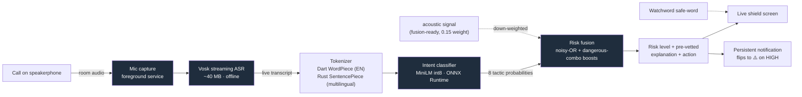

# Kavach — the offline scam-call shield for the phone you already own

> **कवच** *(kavach)* — "armor / shield." Kavach listens to a live phone call **right on
> your device** and warns the person on the call the second a caller starts running a
> manipulation script — *before* the money actually leaves their hands.
> **No cloud. No account. No recording. nothing ever leaves the phone** — like the app literally
> ships with **no `INTERNET` permission at all**, so it *physically cannot* phone home even if it
> wanted to.

Built for the **Beyond Tomorrow Summit 2026** hackathon · and it runs *today* on a **₹8,000 / $80 OPPO A18 (4 GB RAM)**.

---

## 1. The problem

Phone scams quietly became the most expensive crime against normal people — and AI voice cloning
just deleted the last tell we had. A clone only needs a few seconds of audio scraped off social
media, then it calls a parent or a grandparent: *"it's me, i'm in jail, wire the money now, and
please don't tell anyone."*

And the losses aren't vibes, they're documented:

- **US consumers reported losing $12.5 billion to fraud in 2024** — imposter scams alone were
  **$2.95 billion**, the second-biggest category. *(US FTC, 2024 data)*
- **Adults 60+ reported $2.4 billion lost in 2024 — roughly 4× the 2020 number** — and the FTC
  reckons the *real* cost is somewhere between **$10.1–81.5 billion** once you count underreporting.
- The **FBI IC3** puts 2024 losses for Americans 60+ at **~$4.9 billion, average loss $83,000**, up
  **43% in a single year** — the most complaints of any age group. Government-impersonation and
  tech-support **phone** scams alone drove **>$1.3 billion**, seniors eating ~58% of it. *(FBI IC3 2024)*
- The FTC has literally put out consumer alerts warning that scammers now **clone a family member's
  voice** to make the "family emergency" call land harder.

And this isn't just a US thing. Same script, just translated — it runs in Hindi, Tamil, Spanish, and
a dozen more.

## 2. Why nothing out there protects the *victim*

Here's the gap nobody's filling. Every detector that ships — Pindrop, Reality Defender, Sensity, the
carrier spam filters — is **cloud-based, acoustic-only, and built for banks and call-centers.** They
protect *institutions*. Not your grandma.

- **Carrier / spam-list filters block phone *numbers*** → scammers rotate numbers like, hourly.
- **Deepfake-voice detectors ask "is this voice synthetic?"** → which is useless the moment a *real
  human* reads the script, and reviews show they fall apart on compressed phone audio anyway.
- **Server-side AI has to stream your call to the cloud** → which is exactly the thing you can't
  ethically *or* legally do with a vulnerable person's private call (wiretap law, GDPR, all of it).

So the grandmother on her own phone? **Zero** protection. We thought that was kind of insane.

## 3. The Kavach insight

> ### Stop fighting the voice. Fight the *script*.

This is lowkey the whole thesis. Voices keep getting more perfect — but the **social-engineering
playbook literally never changes.** Every scam call, in every language, runs some mix of the same
moves: manufactured urgency, a secrecy demand, an untraceable-payment ask, fake authority, an
emotional distress hook, isolation, a credential probe, a relationship spoof.

**A flawless voice clone reading a scam still trips that exact pattern.** So Kavach's main signal
isn't the audio waveform at all — it's the **intent of the conversation.**

Kavach watches for **8 manipulation tactics** on the live transcript:

| Tactic | Example tell | Weight |
|---|---|---|
| `URGENCY` — manufactured urgency | "you have to act before it's too late" | 0.70 |
| `SECRECY` — secrecy demand | "don't tell anyone, keep this between us" | 0.85 |
| `UNTRACEABLE_PAYMENT` — gift cards / crypto / wire | "go buy a Google Play card and read me the numbers" | 0.95 |
| `AUTHORITY_IMPERSONATION` — police / bank / IRS | "this is the fraud department, there's a warrant" | 0.75 |
| `DISTRESS_HOOK` — fear about a loved one | "i'm in jail, there's been an accident, i need bail" | 0.80 |
| `ISOLATION` — stay-on-the-line | "don't hang up, don't call anyone else" | 0.80 |
| `IDENTITY_PROBE` — codes / PIN / OTP | "read me the one-time code to verify" | 0.90 |
| `RELATIONSHIP_SPOOF` — "it's me" + a voice excuse | "it's your grandson, my voice is different, i have a cold" | 0.60 |

And when the dangerous tactics **stack** (money + urgency, money + distress, authority + money…),
Kavach boosts the risk — because that combo is basically never *not* a scam — then shows a
**plain-language, pre-written explanation and a concrete action.** Those lines are **templated and
deterministic — never LLM-generated** — so the app can *never* hallucinate something to a panicking
user. That part was non-negotiable for us.

**The patient-scam problem.** The dangerous scripts don't blurt everything in one breath — India's
"digital arrest" fraud (₹19,000 cr lost in 2025) spreads its tactics across the *whole* call: fake
authority early, "don't disconnect" isolation in the middle, "transfer to a safe account" much
later. A detector that only scores the hottest sentence misses it. So Kavach keeps a
**conversation-level accumulator** — a decaying memory that fuses tactics *across time* so they
still add up. Measured against 1,378 real FTC robocalls it lifts recall from **28% → 40%** over the
per-window approach, and it's unit-tested on the slow-burn flip. Full numbers and method:
**[docs/EVALUATION.md](docs/EVALUATION.md)** (no demo-clip cherry-picking — independent FTC +
BothBosu datasets, the real on-device model).

### It warns the person who actually gets scammed — out loud, in their language

Here's the uncomfortable truth our pretty on-screen verdict ignores: in India **half the
illiterate population is over 50**, only **~11% of rural elders are digitally literate**, and
**60% of 2024 fraud victims were making their first-ever digital payment** (FTC/I4C; HCI4D
research is blunt — *non-text, voice, local language*). The person losing the money usually
**cannot read** "Likely a scam."

So when the risk rises, Kavach **speaks the warning aloud in the user's own language** —
Hindi, Tamil, Telugu or English — and **buzzes the phone hard**: *"Stop. This call may be a
scam. Do not send money or share any code. Hang up and call your family."* The clips are
**pre-recorded and bundled** (no TTS voice needed on a ₹6,000 phone, nothing synthesised at
runtime, still no network) and the buzz uses a distinct triple-pulse on HIGH. **Validated on
the OPPO A18:** the demo escalates and the phone speaks + vibrates on `STREAM_ACCESSIBILITY`.
Three channels — colour, voice, vibration — so it lands even if you can't read, can't see well,
or can't hear well. Built natively (`SpokenAlert.kt`); the only added permission is `VIBRATE`,
so the **no-internet** guarantee stands.

## 4. How it works — the pipeline, 100% on-device



> Mentally draw a box around all of that labelled **"no `INTERNET` permission."** Every single arrow
> up there stays inside the phone. That's the whole point.

**The two layers — and yeah, both are validated on the actual OPPO A18:**

- **Layer 1 — Live shield (screen on):** user throws the call on speaker and taps *Go live*. Mic →
  Vosk → classifier → risk, updating live with a big, plain-language banner.
- **Layer 2 — Background guardian (screen off):** a `microphone`-type **foreground service** hosts a
  dedicated Dart isolate running the *same* pipeline. The persistent notification just chills as
  "Kavach is guarding" and **flips to "⚠️ Possible scam on this call — don't send money or codes"**
  the instant the script goes dangerous.

**The intervention layer** (honestly, this is the part that actually saves the money):

- **Risk banner** — SAFE / CAUTION / HIGH, in plain words, big accessible text.
- **Watchword** — a pre-set family safe-word a voice clone can't possibly know. Single most
  effective counter to a relationship spoof, full stop: *"what's our word?"*
- **Circuit breaker** — hang up, call the real person back on a number you already trust.

## 5. Why on-device isn't a feature — it's the entire thesis

Kavach uses **no large language model**, on purpose. Speech-to-text is Vosk; intent is a small
fine-tuned classifier; the explanations are pre-written. That one choice buys us four things a cloud
product straight up can't have:

1. **It runs on the phone the victims actually own** — a 4 GB OPPO A18, fully offline. Every cloud
   competitor needs a datacenter or a flagship. We need neither.
2. **Privacy by architecture, not by pinky-promise.** With **no `INTERNET` permission**, the app
   *cannot* leak a call even if it tried — and you can audit that in one line of the manifest.
3. **It can never hallucinate.** Deterministic, pre-vetted advice — no generative model freestyling
   to a scared 80-year-old.
4. **It scales to a billion phones at ~$0 marginal cost.** No servers, no per-minute inference bill.

## 6. What's actually real today (validated on-device, no fake metrics)

We're keeping this table honest — this is stuff we watched run, not stuff we're hoping works:

| Capability | Status | How we know |
|---|---|---|
| 8-tactic intent classifier (English) | ✅ | Fine-tuned `all-MiniLM-L6-v2`, **int8 ONNX, 22.9 MB**; the Dart tokenizer reproduces Python token IDs **exactly** (parity tests) |
| Multilingual analysis (**12 languages**) | ✅ | `paraphrase-multilingual-MiniLM`, int8 ONNX; XLM-R **SentencePiece tokenization via a Rust library (`libkavach_core.so`, arm64)** over `dart:ffi`; host parity tests pass |
| Offline streaming ASR | ✅ | Vosk small EN (~40 MB), <500 ms, runs fine on the A18 |
| Live shield (Layer 1) | ✅ | Validated on the A18 with a **real human voice** — peaked HIGH on scam scripts, stayed chill on normal talk |
| Background guardian (Layer 2) | ✅ | Foreground service reaches "listening" on ColorOS; played a scam clip → caught **HIGH 0.76 `DISTRESS_HOOK`** in the background. Vosk literally heard "accident" as "axe" and it *still* fired |
| Privacy: no network egress | ✅ | Release manifest declares **no `INTERNET` permission** |

## 7. Honest scope (we'd genuinely rather you trust us than oversell)

Kavach is an **advisory early-warning + intervention tool that buys the victim time to think** —
it is **not** a magic box that blocks 100% of scams, and we're not gonna pretend otherwise.

- The **linguistic-intent layer is the hero.** The **acoustic layer is deliberately humble**: it's
  wired into the fusion at a low 0.15 weight, but since phone audio wrecks acoustic deepfake
  detectors, the shipped live verdict rides on the *script*, not the waveform.
- It does **not** tap the carrier/telephony stream (Android just won't let third-party apps do that).
  It listens to the call on **speakerphone**, basically like a careful relative sitting next to you.
- Detection is probabilistic. We tune toward **catching scams (recall)** and lean on the human in
  the loop — the Watchword, the circuit breaker — instead of silently auto-blocking stuff.

## 8. Tech stack

**Flutter / Dart** (UI + pipeline) · **Rust** (SentencePiece tokenizer via `dart:ffi`,
cross-compiled to arm64 with cargo-ndk) · **ONNX Runtime** (int8 on-device inference) · **Vosk**
(offline streaming ASR) · **flutter_background_service** + **flutter_local_notifications** (the
Layer-2 foreground service) · models fine-tuned on a scam-tactic dataset (see [`core/`](core/)).

## 9. Repo map

```
app/            Flutter app (lib/engine = the on-device pipeline)
app/rust/       Rust kavach_core (SentencePiece FFI → libkavach_core.so)
core/           Dataset build + model training (Python / Colab)
docs/           Architecture, privacy & classification, pitch, AI-round prep
```

Go deeper in **[docs/ARCHITECTURE.md](docs/ARCHITECTURE.md)**,
**[docs/PRIVACY_AND_CLASSIFICATION.md](docs/PRIVACY_AND_CLASSIFICATION.md)**, and
**[docs/PITCH_DECK.md](docs/PITCH_DECK.md)**.

---

*Sources for the figures up top: US Federal Trade Commission (2024 fraud data; older-adult fraud
reporting) and the FBI Internet Crime Complaint Center (IC3) 2024 report. These are *reported*
losses — the actual numbers are higher because of underreporting.*
