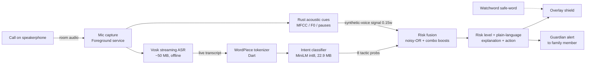

# Kavach — Architecture & Key Decisions

All decisions below are grounded in research done 2026-06-01 (Android platform behaviour, on-device
ASR, on-device inference, audio-deepfake detection). Where a constraint forced a design choice, the
reasoning is recorded honestly — including what Kavach deliberately does *not* try to do.

## System overview

Everything runs **on-device, offline**. No call audio, transcript, or risk data ever leaves the phone.

## Decision 1 — Capture model: ambient guardian, not call interception

**Constraint (researched):** Since Android 10 and still true on 14/15/16 (2026), third-party apps
**cannot** capture the remote party's voice during a phone call — Google blocks two-way call audio
for non-system apps and removed the accessibility-API workaround in May 2022. Worse, during an
*active* telephony call the OS gives mic audio to the call and returns **silence** to ordinary apps
(only accessibility services are exempt). Capturing the live call stream is therefore not possible
for a Play-distributable app.

**Decision:** Kavach is an **ambient call guardian**. With the call on **speakerphone**, the remote
voice is played into the room and Kavach analyses it through the **microphone** — the way a
protective relative sitting next to you would. This needs only `RECORD_AUDIO`, violates no policy,
and matches how the target users (elderly, families) already take risky calls.

**Demo:** to guarantee reliability regardless of same-device telephony mic-muting, the staged scam
call plays from a **second device / speaker**; Kavach on the OPPO A18 listens and shields. We will
*also* empirically test same-device speakerphone capture on the A18, but the demo does not depend
on it.

**What Kavach does NOT claim:** it does not tap the carrier/telephony stream, and it is an
early-warning aid, not a guarantee that blocks every scam.

## Decision 2 — ASR: Vosk (not Whisper)

Vosk: ~50 MB per-language models, true streaming API, <500 ms latency, purpose-built for low-resource
devices (runs on 4 GB Android). whisper.cpp streaming is 1–2 s latency and heavier — too slow for a
live shield. Vosk's lower raw accuracy is acceptable because the downstream classifier is robust to
phrasing (proven: it generalised to unseen vocabulary) and scam tells ("gift card", "jail", "code")
are common words Vosk handles well.

## Decision 3 — Intent classifier on-device: MiniLM int8 via ONNX Runtime

Fine-tuned `all-MiniLM-L6-v2`, 8-label multi-label, **quantized int8 = 22.9 MB, ~4 ms/utterance**
(laptop). Runs in Flutter via the `onnxruntime`/`flutter_onnxruntime` plugin (dart:ffi, NNAPI
acceleration). Tokenization: a small **Dart WordPiece tokenizer** built from the model's `vocab.txt`
(deterministic greedy longest-match). The taxonomy ships as a bundled JSON asset, so fusion +
explanations are identical to `core/kavach_engine.py`.

**Why not a big LLM:** the manipulation taxonomy is a narrow classification problem; a 3–4 B LLM
would not fit the A18 and templated, pre-vetted explanations can never hallucinate to a panicking
user. The constraint is the differentiator — Kavach runs on the cheap phone the victims own.

## Decision 4 — Acoustic layer: humble supporting signal

Rust DSP (reused from prior audio work): MFCC/LFCC, F0/energy prosody, breath/micro-pause
irregularity, vocoder-artifact cues. Research reconfirms acoustic deepfake detection **degrades
badly at phone-call quality**, so this is fused at low weight (0.15) as supporting evidence — never
the verdict. The linguistic-intent layer is the hero precisely because the manipulation *script* is
the invariant a perfect voice clone cannot hide.

## Decision 5 — Foreground service + overlay

Android 14/15: a `microphone` foreground service (requires `FOREGROUND_SERVICE_MICROPHONE` +
`RECORD_AUDIO`, started while in foreground) drives capture; a `SYSTEM_ALERT_WINDOW` Truecaller-style
overlay shows the live shield. UX flow: user taps **Start Guardian Mode** (foreground) → overlay
appears → capture begins → risk + explanation render live.

## Intervention layer (the UX that wins Design/Presentation)

- Large, accessible, plain-language risk banner (SAFE / CAUTION / HIGH).
- **Circuit breaker:** one tap to hang up and call the real contact on a known number.
- **Guardian alert:** opt-in notification to a trusted family member on a high-risk call.
- **Watchword:** prompts the pre-set family safe-word a voice clone can't know.
